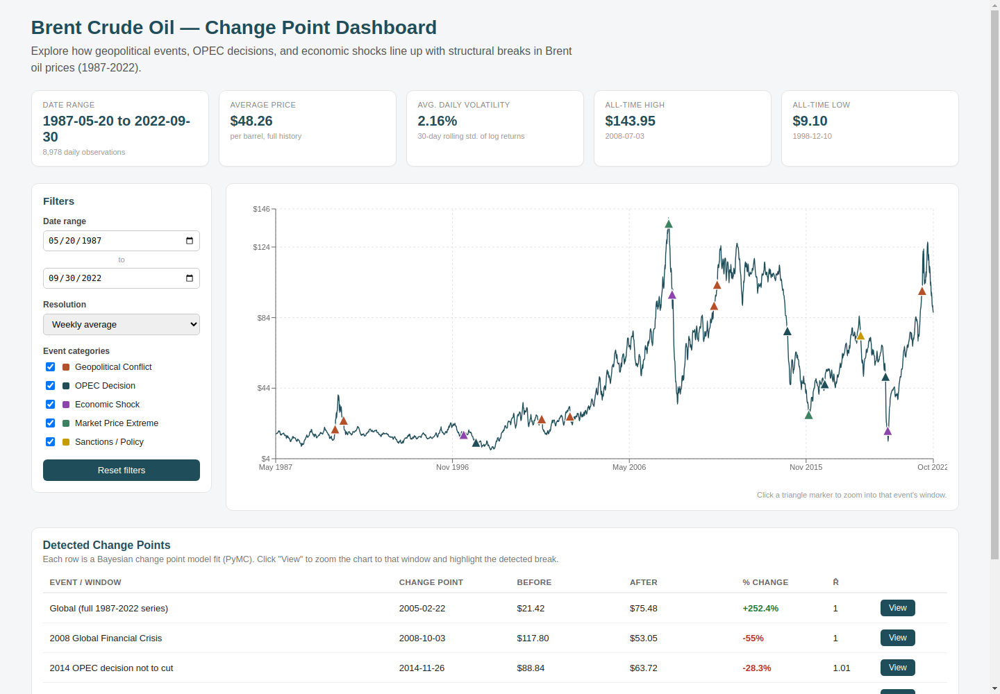
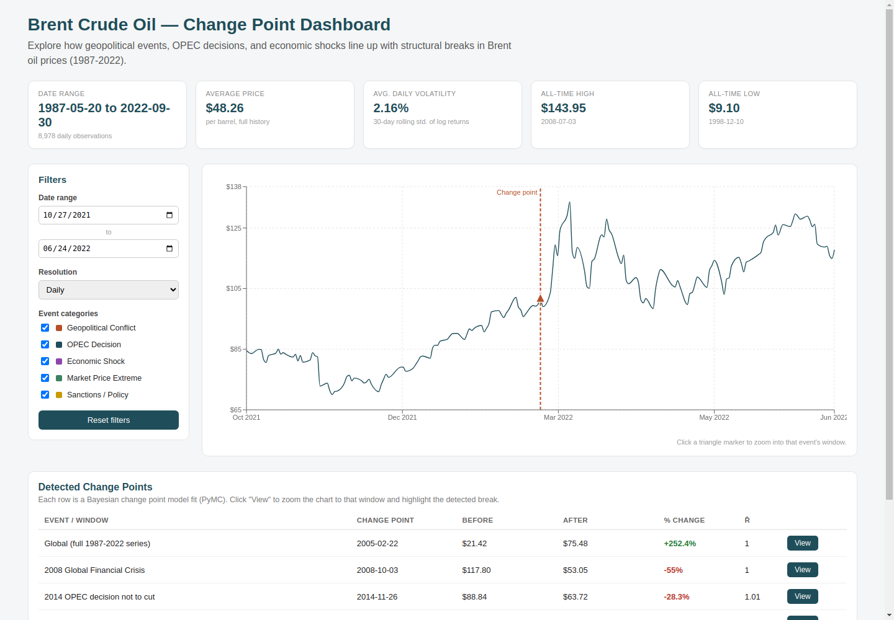
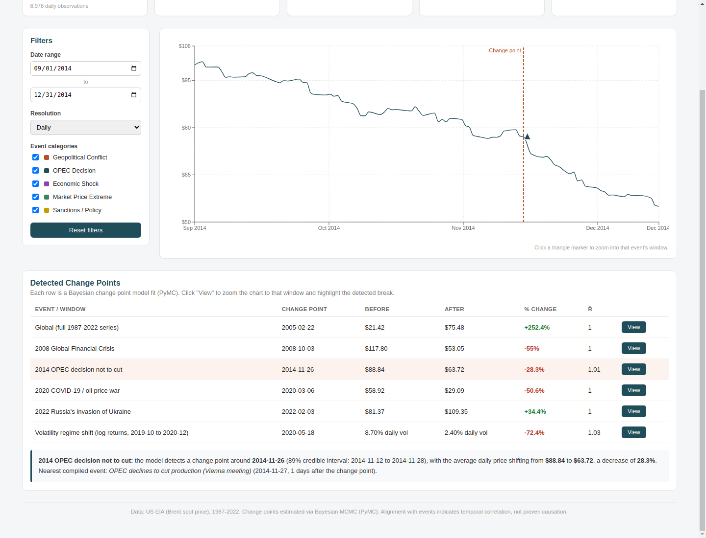
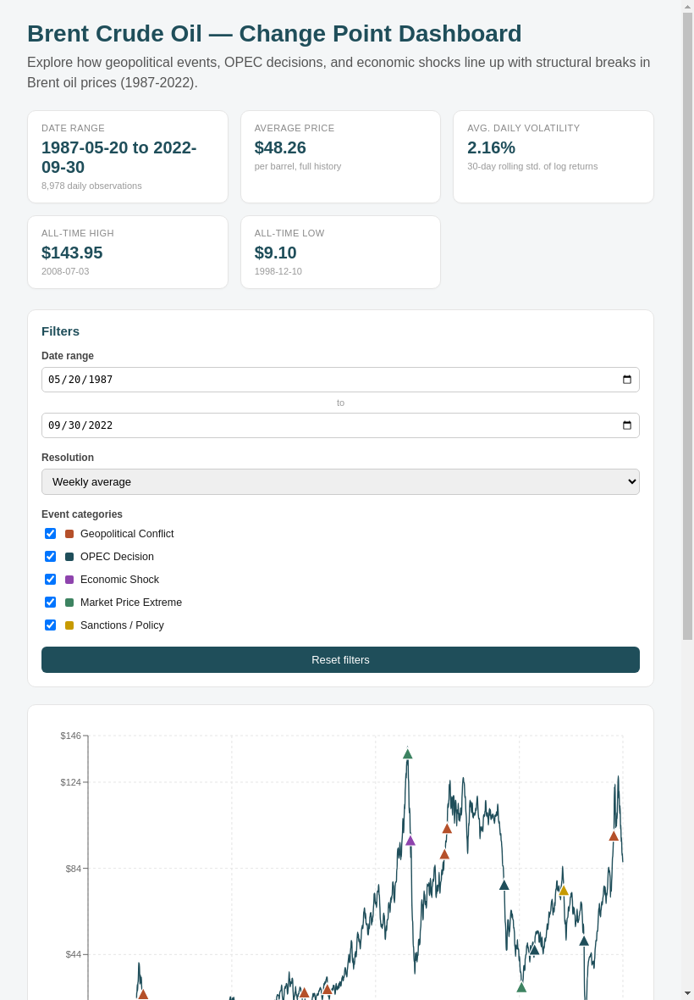
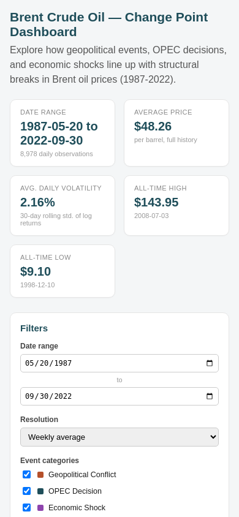
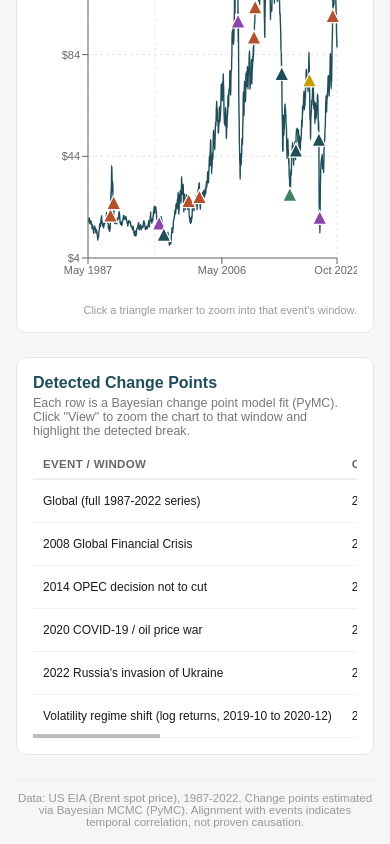

# Change Point Analysis and Statistical Modeling of Time Series Data

Analysis of Brent crude oil prices to detect structural breaks (change points) and
associate them with major geopolitical, OPEC, and macroeconomic events.

## Project Status

- [x] **Task 1 — Foundations:** analysis workflow, compiled event dataset, assumptions
      and limitations, and initial EDA (trend, stationarity, volatility).
- [x] **Task 2 — Change point modeling:** Bayesian change point detection (PyMC),
      global + event-focused windows, volatility change point, causal-association
      discussion.
- [x] **Task 3 — Interactive dashboard:** Flask API backend + React (Vite/Recharts)
      frontend for exploring price trends, events, and change points.

## Project Structure

```
├── .vscode/               # Editor settings (Python path, pytest integration)
├── .github/workflows/     # CI: runs the test suite on push/PR
├── data/
│   └── raw/
│       ├── BrentOilPrices.csv        # Daily Brent price series (Date, Price)
│       └── brent_oil_key_events.csv  # 17 compiled market events (Task 1 deliverable)
├── src/                   # Reusable, unit-tested analysis code
│   ├── data_loader.py     # Loading/cleaning price & event data
│   ├── eda.py             # Stationarity tests, volatility, descriptive stats
│   └── change_point.py    # Bayesian change point models (PyMC) + helpers
├── notebooks/
│   ├── task1_eda.ipynb                 # Task 1 initial EDA notebook
│   └── task2_change_point_modeling.ipynb  # Task 2 change point modeling notebook
├── scripts/                # One-off / helper scripts (not part of the core package)
├── tests/
│   ├── test_task1_eda.py      # Unit tests for data_loader.py / eda.py
│   └── test_change_point.py   # Unit tests for change_point.py (fast synthetic data)
├── backend/                # Task 3: Flask API
│   ├── app.py                    # API endpoints (prices, events, changepoints, metrics)
│   ├── precompute_changepoints.py  # Offline script: runs PyMC models -> data/changepoints.json
│   ├── data/                     # Copies of price/event CSVs + precomputed changepoints.json
│   ├── tests/test_app.py         # API endpoint tests (Flask test client)
│   └── requirements.txt
├── frontend/                # Task 3: React (Vite) dashboard
│   ├── src/
│   │   ├── App.jsx                    # Main layout/state
│   │   ├── api.js                     # Fetch wrappers for the Flask API
│   │   ├── categoryColors.js
│   │   └── components/
│   │       ├── KpiCards.jsx
│   │       ├── Filters.jsx
│   │       ├── PriceChart.jsx         # Recharts price line + event markers
│   │       └── ChangePointPanel.jsx   # Change point table + drill-down
│   ├── vite.config.js             # Dev proxy: /api -> Flask on :5000
│   └── package.json
├── docs/screenshots/        # Task 3 deliverable screenshots
├── requirements.txt
└── README.md
```

## Getting Started

```bash
python -m venv .venv
source .venv/bin/activate        # Windows: .venv\Scripts\activate
pip install -r requirements.txt
```

Open the folder in VS Code (the included `.vscode/settings.json` configures the
Python path and pytest integration), then open `notebooks/task1_eda.ipynb` and
run all cells — or from the command line:

```bash
jupyter nbconvert --to notebook --execute --inplace notebooks/task1_eda.ipynb
```

Run the test suite:

```bash
pytest tests/ -v
```

## Data

`data/raw/BrentOilPrices.csv` currently contains the real, public daily Brent spot
price series (US EIA, via FRED series `DCOILBRENTEU`, sourced from
[github.com/datasets/oil-prices](https://github.com/datasets/oil-prices)),
covering 1987-05-20 onward. If your course/project provides an official dataset
file, replace this file with it — as long as it has `Date` and `Price` columns,
no code changes are needed.

## Task 1 Summary

See the accompanying report (`Task1_Foundation_Analysis.docx`) for the full
write-up. Headline EDA findings, reproduced in `notebooks/task1_eda.ipynb`:

- **Trend:** Brent prices move through distinct multi-year regimes (1990s stability,
  2008 spike/collapse, 2014-16 decline, 2020 COVID-19 crash, 2022 spike) rather than
  one smooth trend — motivating a change point approach.
- **Stationarity:** ADF and KPSS both indicate the raw price level is non-stationary,
  while log returns are approximately stationary. Modeling should operate on returns.
- **Volatility:** Returns show volatility clustering and heavy tails (high kurtosis,
  negative skew) — variance is not constant over time.
- **Events:** compiled a 17-event dataset (1990-2022) spanning geopolitical conflicts,
  OPEC decisions, economic shocks, and sanctions, for later cross-referencing against
  detected change points.

**Important caveat:** any alignment between a detected change point and a compiled
event date indicates temporal correlation, not proven causation — see the
assumptions/limitations section of the Task 1 report for details.

## Task 2 Summary

See `notebooks/task2_change_point_modeling.ipynb` for the full analysis. Headline
results:

- **Global model** (mandatory core model, single `tau` over the full 1987–2022
  series): detects the single largest structural break at **~23 Feb 2005**, with
  the mean price shifting from **$21.42 to $75.48 (+252%)**. This reflects a
  gradual, multi-year demand-driven regime shift (the mid-2000s commodity
  supercycle) rather than a single discrete trigger — the nearest compiled event
  (2003 Iraq War) is ~2 years prior, too distant for a clean one-to-one story.
- **Event-focused windows** around four well-known shocks each converge cleanly
  (`r_hat` = 1.00–1.01) and align tightly with documented events:
  - 2008 Global Financial Crisis: **-55%** ($117.80 → $53.05), ~2.5 weeks after Lehman's collapse
  - 2014 OPEC decision not to cut: **-28%** ($88.84 → $63.72), within 1 day of the actual meeting
  - 2020 COVID-19 / oil price war: **-51%** ($58.92 → $29.09), at the failed OPEC+ talks
  - 2022 Russia's invasion of Ukraine: **+34%** ($81.37 → $109.35), ~3 weeks *before* the invasion (anticipatory pricing)
- **Volatility change point** (log returns, 2019–2020): daily volatility fell by
  roughly **73%** as markets stabilized after the 2020 shocks — a less cleanly
  converged, more indicative result.
- All change-point/event alignments are reported as plausible, well-timed
  associations, not proof of causation.

## Task 3 — Interactive Dashboard

A full-stack dashboard for exploring the price series, compiled events, and Task 2's
change point results interactively: Flask API backend + React (Vite + Recharts) frontend.

### Architecture

```
Browser  <--->  React (Vite dev server, :5173)  <--->  Flask API (:5000)  <--->  CSV / precomputed JSON
```

The four Bayesian change point models from Task 2 take 1-2 minutes of MCMC sampling to
run — far too slow for a live HTTP request. So `backend/precompute_changepoints.py` runs
them **once, offline**, and writes the results to `backend/data/changepoints.json`. The
Flask app then just reads and serves that static file — instant API responses, with the
real underlying model results.

### API Endpoints (Flask, `backend/app.py`)

| Endpoint | Description | Query params |
|---|---|---|
| `GET /api/health` | Liveness check | — |
| `GET /api/prices` | Historical Brent price series | `start`, `end` (ISO dates), `freq` (`D`/`W`/`M`) |
| `GET /api/events` | Compiled event dataset | `category` (comma-separated), `start`, `end` |
| `GET /api/changepoints` | Precomputed change point model results (global, 4 event windows, volatility model) | — |
| `GET /api/metrics` | Summary KPIs (mean price, volatility, min/max) | — |

Full docstrings for each endpoint are in `backend/app.py`.

### Dashboard Features

- **Price chart** (Recharts) with daily/weekly/monthly resolution toggle
- **Event highlight markers** — colored triangles on the price line, one per compiled
  event, color-coded by category; **click a marker to drill down** — the chart zooms to
  a ±120-day window around that event
- **Change point panel** — a table of every Task 2 model result (global + 4 event
  windows + the volatility model); **click "View" to drill down** — the chart zooms to
  that model's window, shades it, marks the exact change point date, and a written,
  data-driven interpretation appears below the table
- **Filters** — date range selectors and event-category checkboxes (which also filter
  the chart's markers)
- **KPI cards** — date range, average price, average volatility, all-time high/low
- Responsive layout — sidebar collapses above the chart on tablet/mobile, KPI cards
  reflow, tables scroll horizontally on narrow screens

### Setup Instructions

**1. Backend (Flask):**
```bash
cd backend
python -m venv .venv
source .venv/bin/activate        # Windows: .venv\Scripts\activate
pip install -r requirements.txt

# (Optional) regenerate data/changepoints.json from scratch — takes 1-2 minutes.
# A precomputed copy is already included, so this step is optional unless you've
# changed the underlying data or model.
python precompute_changepoints.py

python app.py
```
The API will be running at `http://localhost:5000`.

**2. Frontend (React):**
```bash
cd frontend
npm install
npm run dev
```
Open `http://localhost:5173` in your browser. The Vite dev server proxies `/api/*`
requests to the Flask backend automatically (see `vite.config.js`), so no CORS
configuration is needed in development.

**3. Run the backend API tests:**
```bash
cd backend
pytest tests/ -v
```

**Production build** (frontend static files, optional):
```bash
cd frontend
npm run build      # outputs to frontend/dist/
npm run preview    # serve the production build locally to sanity-check it
```

### Screenshots

**Desktop — overview**


**Desktop — event drill-down** (clicked the "Russia's invasion of Ukraine" marker;
chart zoomed to a window around it and marked the exact change point date)


**Desktop — change point drill-down** (clicked "View" on the 2014 OPEC row; chart
zoomed to that window, the row highlighted, and a written interpretation appeared)


**Tablet**


**Mobile**


**Mobile — change point table** (horizontally scrollable on narrow screens)

